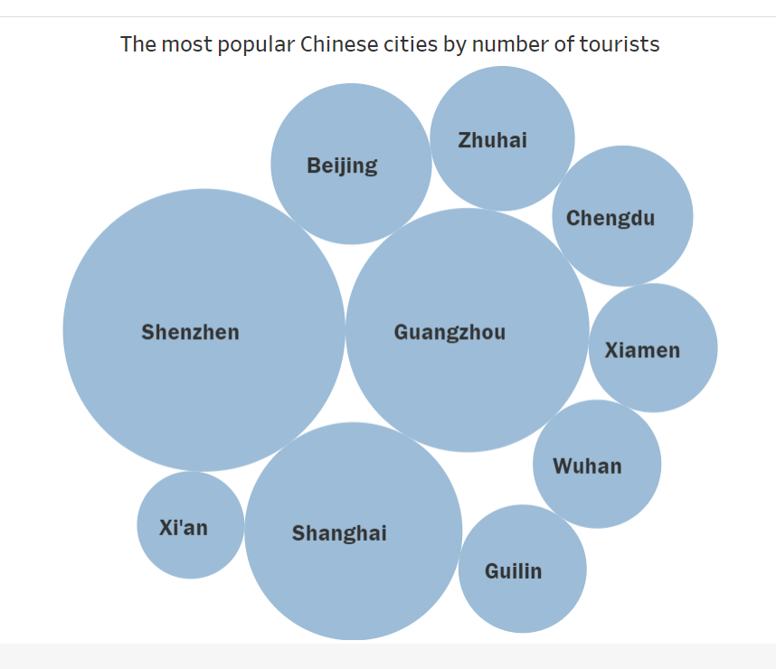

| [home page](https://cmustudent.github.io/tswd-portfolio-templates/) | [visualizing debt](visualizing-government-debt) | [critique by design](critique-by-design) | [final project I](final-project-part-one) | [final project II](final-project-part-two) | [final project III](final-project-part-three) |

# Story and wireframe:
## Topic: After nationalwide quarantine, is China still a good travel destination?
# -------------------
## Everything domestic in China that you should know:(Picture 1)
## (Domestic Policy) Quarantine’s passing away(Picture 2)
## (Health Concerns) COVID-19 is still at large in China:(Picture 3)
# --------------------
### Some downsides you should be concerned with…
## VISA-Only cards are not commonly supported
# Over 99% stores will not accept VISA-Only card
# -----------------
## Is China a tourist attraction to you compared with other Asian countries?
# Answer to the question at the very beginning:
#

# Data visualization

## There are several other pitcures/ DataViz in Shorthand not shown here.
# --------------
# --------------
# --------------
# User Research protocol
## The target audience is people living in western countries, especially in NA and EU. The whole project is for them.
## ----
## I asked two graduate students who are already economically independent. One is male, the other is female.
## The third interviewer is an old lady, a professor in CMU, who has broad world view and can give her opinion with historical features. 
## ----
## Internview questions:
### 1. Do you think the great difference in political ideology refrain you from visiting China?
### 2. Are you going to plan a domestic or international trip during your vacation this year or in the next two year?
### 3. Do you have preferred Asian countries as the travel destination? If you do, please sort them in the preference degree
# -------
# User research: findings:
### Interestingly, different from data on people from UK, who prefer India, Pakistan, and China, people in US prefer South Korea, Japan, and China.
### Some American who had never come to China before will not choose China as the travel destination, but those who had ever did would definitely go.
### American who don't wish to go to China are concerned about many aspects, such as culture difference, political ideology difference, and more.
### But when I asked them if a series of Asian coutries can be visited (e.g. First going to Japan, then South Korea, and China, finally India and Pakistan), all interviewers were glad to incorporate China as one of the stops.
